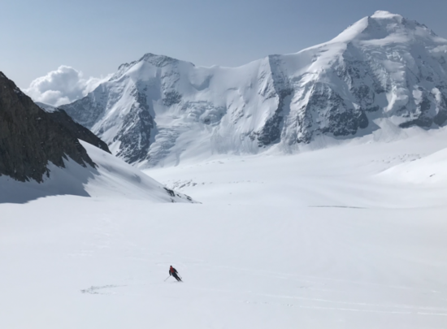
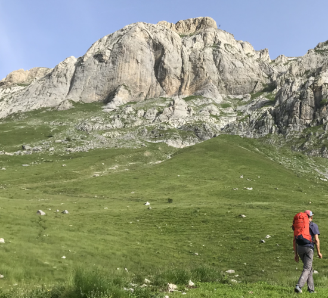
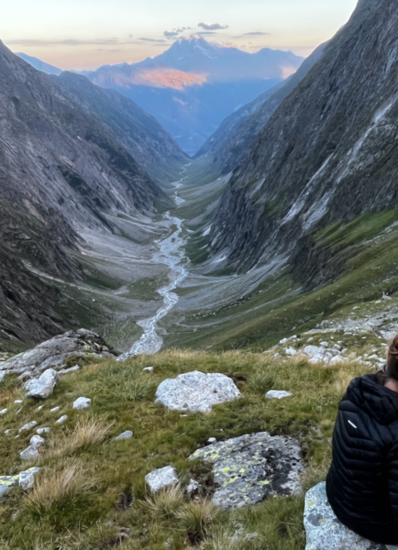
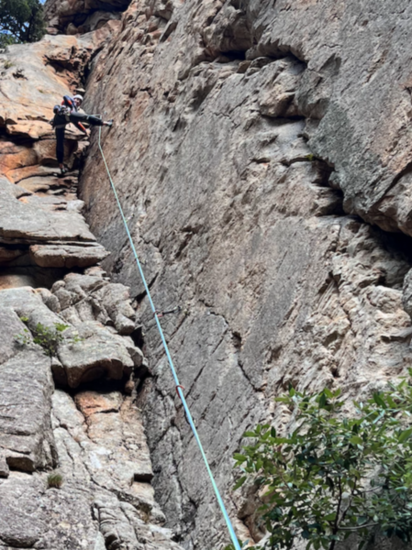
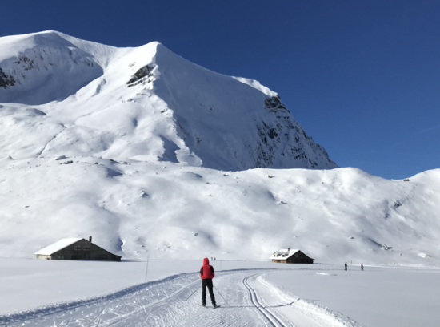

# Mountains

A log of (some of my) outings. Entries before approx. 2023 not reported.

([Back to the home page](/))

## Le petit Velan, couloirs E and W, 7 Jan 2023
From Bourg St Pierre, little snow in the east couloir, descended west, and closed the loop through the Refuge du Velan.  

## Bel Oiseau, Couloir, 4 Feb 2023
Through the classical itinerary, and then down the colouir near the summit. Good snow. 

## Le Ritord, Couloir, 12 Feb 2023
From Bourg St Pierre. Amazing, amazing, amazing! 

## Mont Buet, classic itinerary
From Buet-Vallorcine.

## Tellier, Couloir, 17 Feb 2023
From north-entrance of GSB tunnel. With Alex! Thanks for the visit!

## Pointe des Grands, 17 Feb 2023
From Trient. With G. and A.

## Landvogtehore, 5 Mar 2023
My first time in Diemtigtal. Going to become a classic...! 

## Rothorn, 6 Mar 2023
Hard snow on top, with couteaux.

## Spitzhorli, Apr 3 2023
From Simplon pass. 

## Aiguille du Tacul, Apr 8 2023
Start of holiday week! From Aiguille du Midi, partial descent on Valle Blanche, up to the summit, and then down. Many people on the way back to chx.  (dramatic avalanche on Dome du Miage) 

## Traversee Chx - Buet, Apr 10 2023
With lift to l'index, Col du Belveder, then down the couloir, and to Buet. Very pretty. 

## Rocca Sbarua, 13 Apr 2023
Sun is over in chamonix valley. Going south looking for good weather.  

## Mottarone, 15 Apr 2023
Single-pitches in Mottarone. Not too great, not too bad.  Good hike.

## Untracked outings
Can't remember where we went!

## Sustenhorn, 22 May 2023
Through the classic itinerary from Sustenpass. I broke my binding. Good conditions otherwise. 

## Wiwannihorn, weekend of 27 and 28 May 2023
Amazing Wiwannihorn! Walking up from the valley, night in the shelter, and two climbing routes (Wi vom Fass, Verborgene Tenze). Still snow on the routes and on the descent. 

## Traverse Jungfraujoch - Loetschental, 29 May 2023
Traversee from Jungfraujoch to Loetschental. That's the end of an excellent ski-touring season! With G.'s skies. Short detour to avoid a thin snow brigde over huge crevasse (while we have seen others passing). Saw someone coming down from the north face of Aletschorn with about 5 turns in total... amazing!

## Climbing in Grimsel and Orvin, weekend of 3 Jun 2023
Attempted Bugeleisen; ended up on the wrong route and gave it up at the 3rd pitch.

## Sagittarius, 11 Jun 2023
I cheated on the crux. 

## Punta Udine, 18 Jun 2023
Visto per il Peru'. Very nice. Rain on the last pitch. Descend with crampons on the north face. On the way down, recover the material of two Italian which helped two Spanish who wore approach shoes and could not go down. Discovered on the top that I climbed with the laptop in the backpack (deadline of the flagship is approaching..!).

## Punta Venezia, 19 Jun 2023
Fable de Venise. Stopped at the first tower.

## Rocca dei campanili - Mongioie, 21 Jun 2023
Climbed Alba Celtica ed Pellegrinaggio in Oriente (3 pitches). Spot the lama in the pic!

## Lago d'Agaro, 24 Jun 2023
Done two routes. The fox ate the nut cake in the night! Bad!

## Jeggihorn, 1 Jul 2023
Climbed Netlo S-O. Cold night in the tent.

## Bietschhorn ridge SE-N, 9-11 Jul 2023 
From Baltschiederklause to Bietschhorn Hutte through the summit, in 14 hours. Nice climb on the way up; descend never ends. Started at 5:00, summit at 10:30, at the shelter at 19:00. In the glacier, ended up in the water until the knee. Traversee on the snow was good. Climb up efficient. On the way down, found a lot of snow and frozen patches, had to protect a lot in these places. 

## Val Ferret, 14 Jul 2023
A few days clmibing on the granite of Val Ferret. Stayed in the busy and moderately dirty winter room of Dalmazzi. My questions ("*scusi, ma il Dalmazzi e' aperto?*", "*il locale invernale del Dalmazzi e' tenuto bene?*") to literally everyone in Courmayeur are now legendary. Climbs: La Beresina, Les chamois volants (with its amazing 17 rappels) on Monts Rouges de Triolet, Genepi (Parete dei Titani), and il gatto e la volpe (without headwall).

## Eldorado, 30 Jul 2023
Frustrating weekend in Grimsel Eldorado :D. Climbed the first few pitches of Motorhead before the sunset on the first day. The second day, gave it up at the first pitch (!) Gletscher Weiss.

## Gallihorn, 3 Aug 2023
Climbed Gaelliwaendli. Pure plaisir. Had to regain motivation after the Eldorado defeat :).

## Alpe Nimi, 7 Aug 2023
Two-day hike with friends in Canton Ticino. A lot of goats. A lot of cheese.

## Furka pass, 12 Aug 2023
Hannibalturm on the first day. Climbed Evalin to Furkahorn on the second day, amazing route. 

## Grindelwald, 15 Aug 2023
Turistic outing with my parents to see the north face of Eiger, but not everyone has the same taste!

## Nesthorn, South Ridge 20 Aug 2023
In 3 day, from Naters. Very pretty and in good conditions. Precautionasly, with 2 ice axes for the way down. In the pic, view on Weissmies from the Gredetschental.

## Val Masino, 2 Sep 2023
Stayed at Gianetti (Met Cedric in the shelter :D) and Allievi. Climbed Punta Torelli (via Mauri-Fiorelli, cold!) Punta Allievi (Spigolo Gervasutti, tres bien passé!), Spigolo Gervasutti. In the valley, stayed at Lo Scoiattolo. 

## Pizzo del Prevat, 4 Sep 2023
Back from Italy, we climbed Pizzo del Prevat (north-east ridge) da Capanna Leit. Very pretty!

## Albertheim (Furkapass), 9 and 10 Sep 2023
Climbed Mangolito to Winterstock on the first day. On the second, climbed the SW pillier of Dammazwillinge. With Martina and Mathias.

## Gallihorn, 17 Sep 2023
Lowenherz. Crux very exposed. No pics!

## Grand Perron, 14 Sep 2023
Paroi de Barberine, mille et un pattes. With Ted and Eoin. Nice friends, less nice climb :D.

## Grand Perron, 15 Sep 2023
Au cour de l'anticyclone. Very pretty route. Effortless 6b of G.!
 

## San Domenic0, 1 Oct 2023
On the way back from Lorenzo and Maria wedding in Bologna, stop in San Domenico di Varzo for climbing Fifth Avenue. Very pretty! Short rope when rapelling. Bring a double rope next time!

## Brusson and Castore, weekend of 7 Oct 2023
Visited Giovanni and Elisa in Brusson and used the chance to climb the south ridge of Castore ([this route](https://www.gulliver.it/itinerari/castore-cresta-sud/)). Nice, but a bit sketchy sometimes. Down from the normal way. Slept in the winter room of Rifugio Sella. Down with the jeep from the col di bettaforca.

## Climbing week in Corsica, 27 Oct 2023
Mostly Restonica valley. Definetely to be repeated.

## Arnad, 11 and 12 Nov 2023
Climbed in Paretone di Arnad, Monte Strutto, and Albard di Bard (quattro amici al bar and another easy one, with the second being much nicer). 

## Pontemaglio, 20 Nov 2023
And the last climb of the year is: Pachamana in Pontemaglio! Crazy passage in the dihedral. Highlight of the day was the focaccia in the morning! And nice bike tour.

## Cross-country skiing, 26 Nov 2023
Yay, snow! Cross-country skiing in Engstligenalp with a mild temperature of -20 degree Celsius.

## Meniggrat, 27 Nov 2023
First ski touring of the season. Little snow.

## From Greberegg down to Thun lake in Leissigen, 2 Dec 2023 
If we could sum up all the snow we got this winter, we would have snow until late summer.

## Albristhubel, 3 Dec 2023 
From St. Stephan. Nearly too much snow to ski down.

