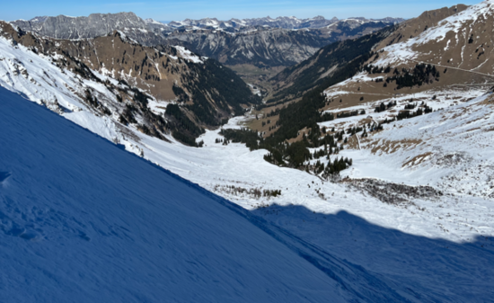
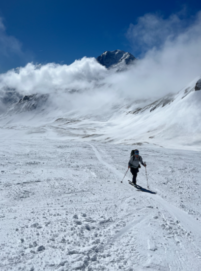
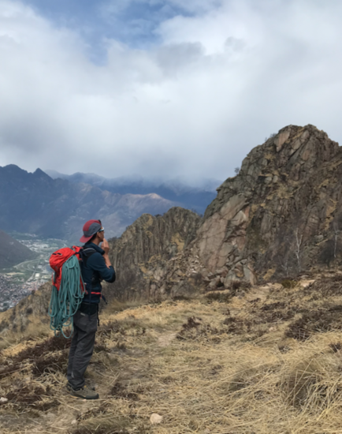
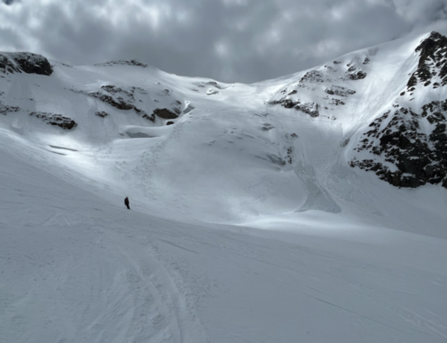
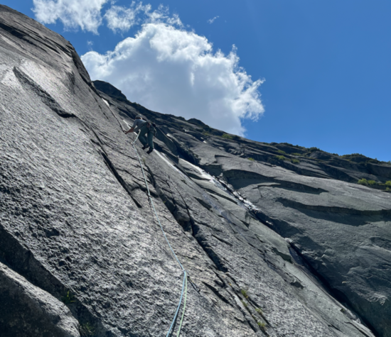
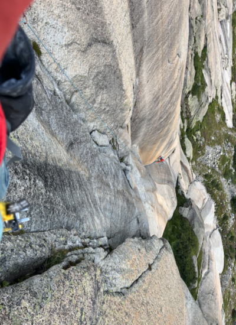
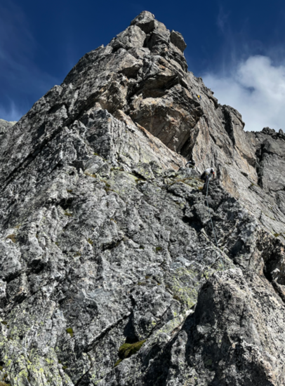
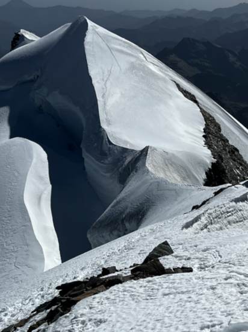

# Mountains

A log of (some of my) outings. Entries before approx. 2023 not reported.

([Back to the home page](/))

## Le petit Velan, couloirs E and W, 7 Jan 2023
From Bourg St Pierre, little snow in the east couloir, descended west, and closed the loop through the Refuge du Velan.  

## Bel Oiseau, Couloir, 4 Feb 2023
Through the classical itinerary, and then down the colouir near the summit. Good snow. 

## Le Ritord, Couloir, 12 Feb 2023
From Bourg St Pierre. Amazing, amazing, amazing! 

## Mont Buet, classic itinerary
From Buet-Vallorcine.

## Tellier, Couloir, 17 Feb 2023
From north-entrance of GSB tunnel. With Alex! Thanks for the visit!

## Pointe des Grands, 17 Feb 2023
From Trient. With G. and A.

## Gsur (?), 5 Mar 2023
My first time in Diemtigtal. Going to become a classic...! 

## Spitzhorli, Apr 3 2023
From Simplon pass. 

## Aiguille du Tacul, Apr 8 2023
Start of holiday week! From Aiguille du Midi, partial descent on Valle Blanche, up to the summit, and then down. Many people on the way back to chx.  (dramatic avalanche on Dome du Miage) 

## Traversee Chx - Buet, Apr 10 2023
With lift to l'index, Col du Belveder, then down the couloir, and to Buet. Very pretty. 

## Rocca Sbarua, 13 Apr 2023
Sun is over in chamonix valley. Going south looking for good weather.  

## Mottarone, 15 Apr 2023
Single-pitches in Mottarone. Not too great, not too bad.  Good hike.

## [ .. ] Untracked outings

## Sustenhorn, 22 May 2023
Through the classic itinerary from Sustenpass. I broke my binding. Good conditions otherwise. 

## Wiwannihorn, 27 and 28 May 2023
Amazing Wiwannihorn! Walking up from the valley, shelter, and two climbing routes. Still snow on the routes and on the descent. 

## Traverse Jungfraujoch - Loetschental, 29 May 2023
Traversee from Jungfraujoch to Loetschental. That's the end of an excellent ski-touring season!

## Climbing in Grimsel and Orvin, weekend of 3 Jun 2023
Attempted Bugeleisen; ended up on the wrong route and gave it up at the 3rd pitch.

## Sagittarius, 11 Jun 2023
I cheated on the crux. 

## Bietschhorn ridge SE-N, 9-11 Jul 2023 
From Baltschiederklause to Bietschhorn Hutte through the summit, in 14 hours. Good conditions. Nice climb on the way up; descend never ends. 

## Val Ferret, Week of the 14 of Jul 2023
Climbing week in the granite of Val Ferret. Stayed in the busy and moderately dirty winter room of Dalmazzi. Climbed Done La Beresina, Aiguille Rouge de Triolet, Genepi (Parete dei Titani), and one down in the valley. 

## Eldorado, 30 Jul 2023
Frustrating weekend in Grimsel Eldorado :D. Climbed the first few pitches of Motorhead before the sunset on the first day. The second day, gave it up at the first pitch (!) of Weisse Dame (?). 

## Around Furka pass, 12 Aug 2023
Hannibalturm on the first day. Climbed Evalin to Furkahorn on the second, amazing route. 

## Grindelwald, 15 Aug 2023
Turistic outing with my parents to see the north face of Eiger, but not everyone has the same taste!

## Nesthorn, South Ridge 20 Aug 2023
In 3 day, from Naters. Very pretty and in good conditions. Precautionasly, with 2 ice axes for the way down. In the pic, view on Weissmies from the Gredetschental.

## Val Masino, 2 Sep 2023
Stayed at Gianetti (Met Cedric in the shelter :D) and Allievi. Climbed Punta Torelli (via Mauri-Fiorelli, cold!) Punta Allievi (Spigolo Gervasutti, tres bien passé!), Spigolo Gervasutti. In the valley, stayed at Lo Scoiattolo. On the way back, climbed Pizzo del Prevat (north-east ridge) da Capanna Leit. Very pretty.

## Brusson and Castore, weekend of 7 Oct 2023
Visited Giovanni and Elisa in Brusson and used the chance to climb the south ridge of Castore ([this route](https://www.gulliver.it/itinerari/castore-cresta-sud/)). Nice, but a bit sketchy sometimes. Down from the normal way. Sleeped in the winter room of Rifugio Sella.

## Climbing week in Corsica, 27 Oct 2023
Definetely to be repeated.

